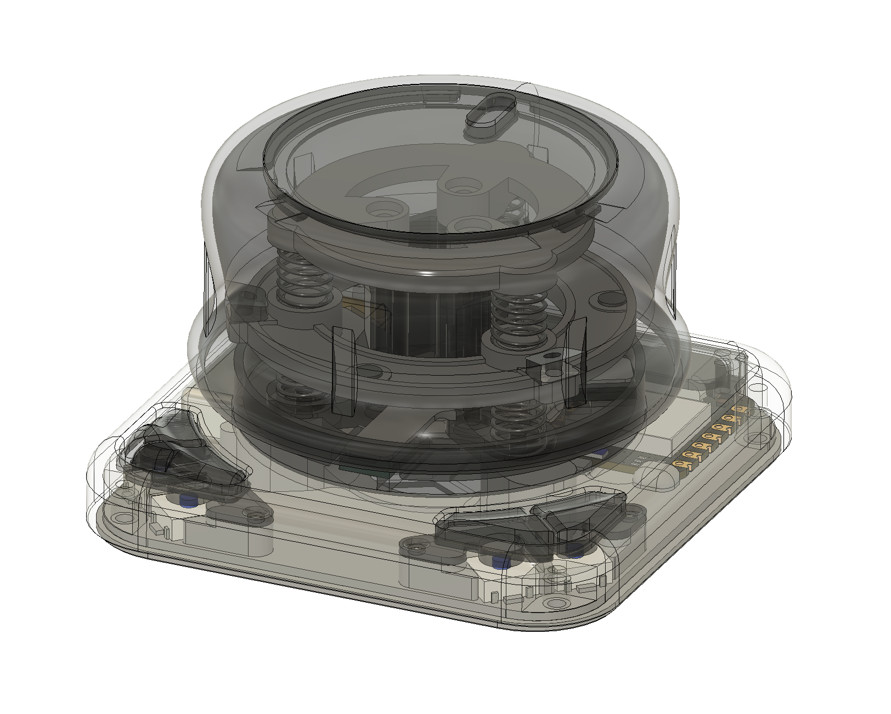
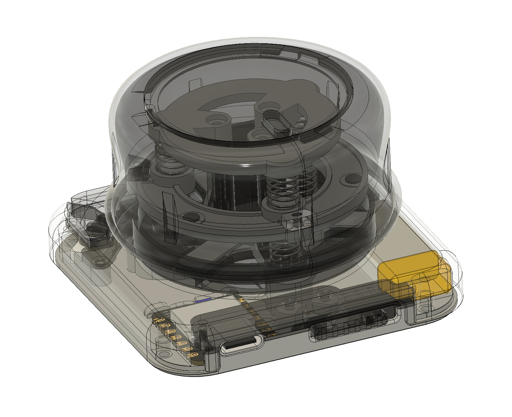
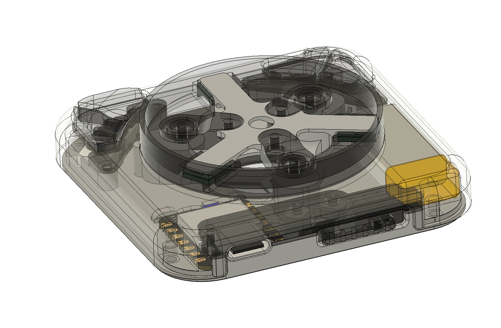
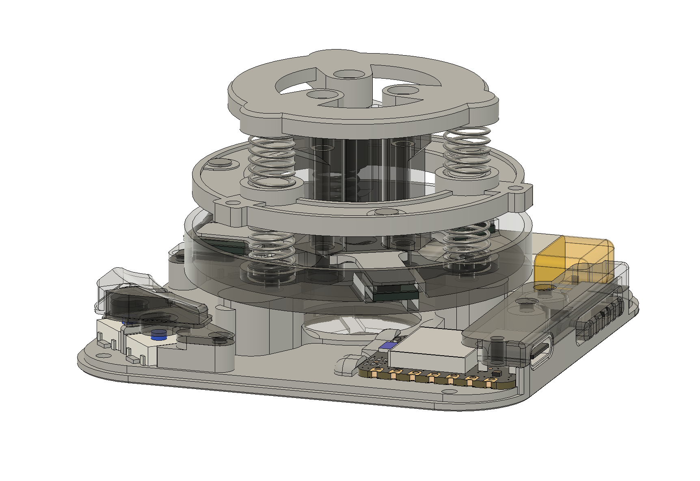
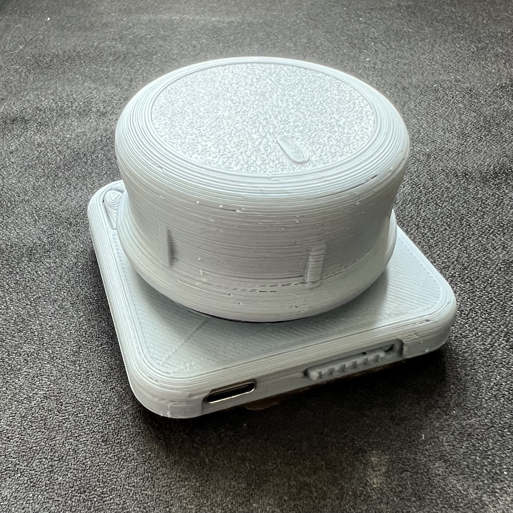
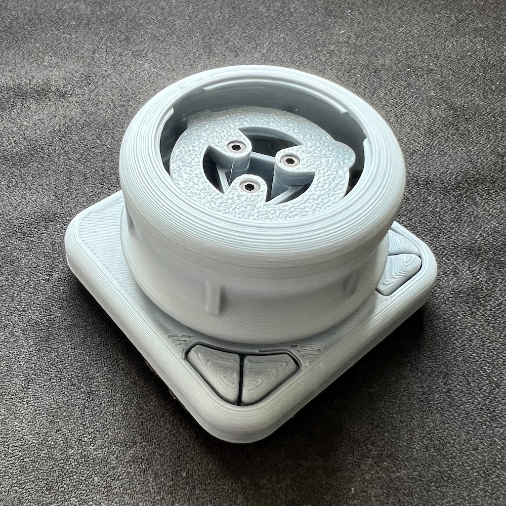
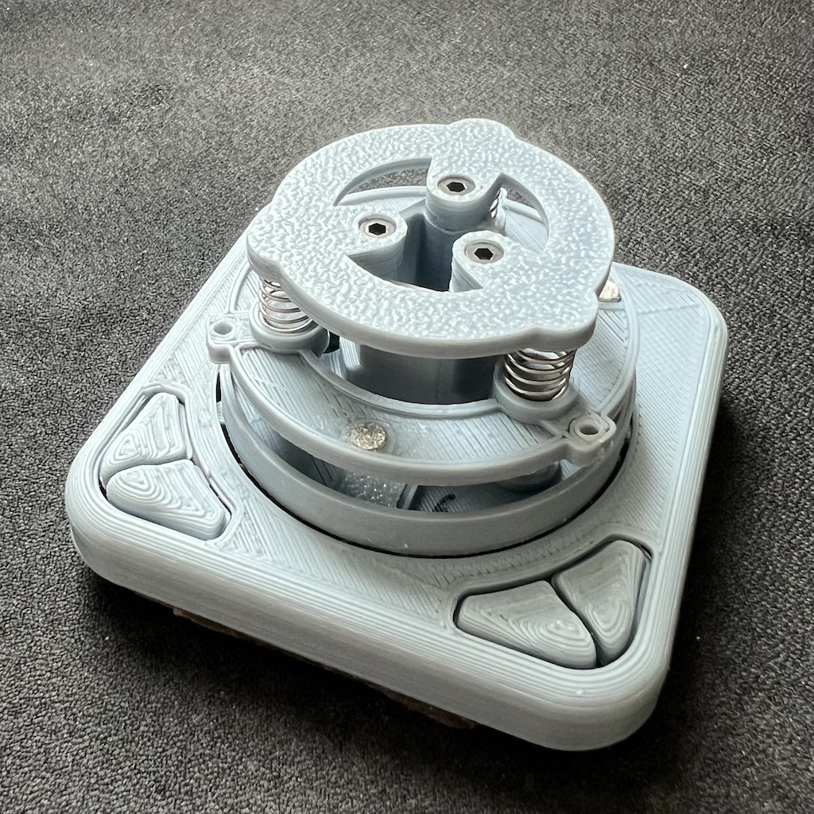
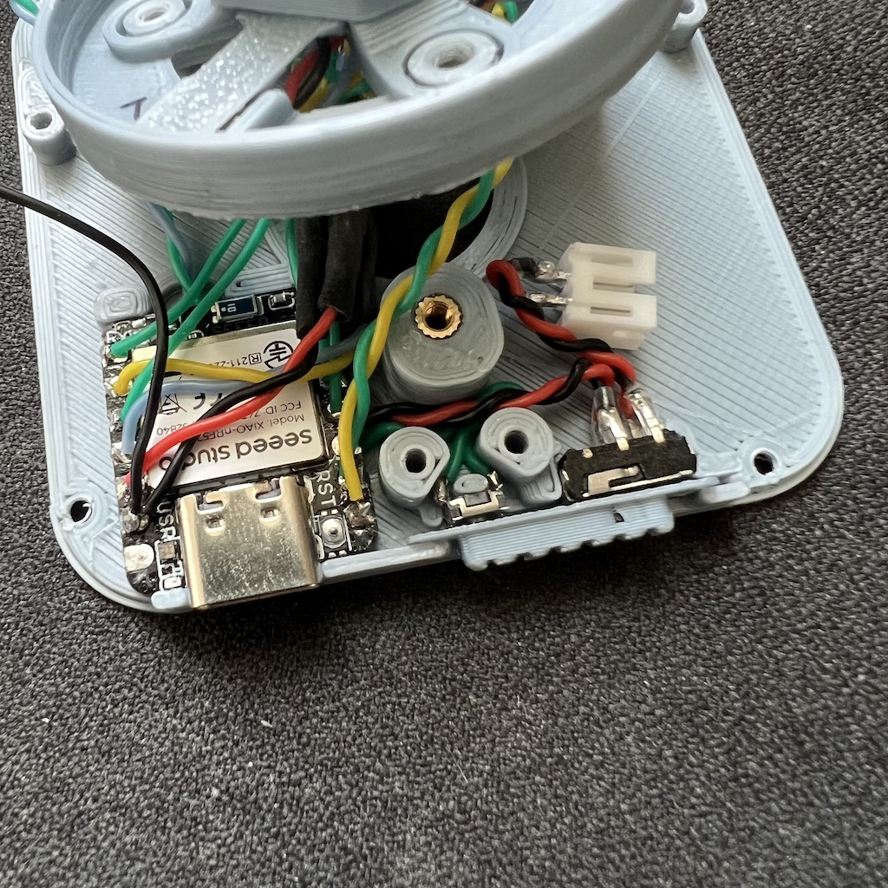
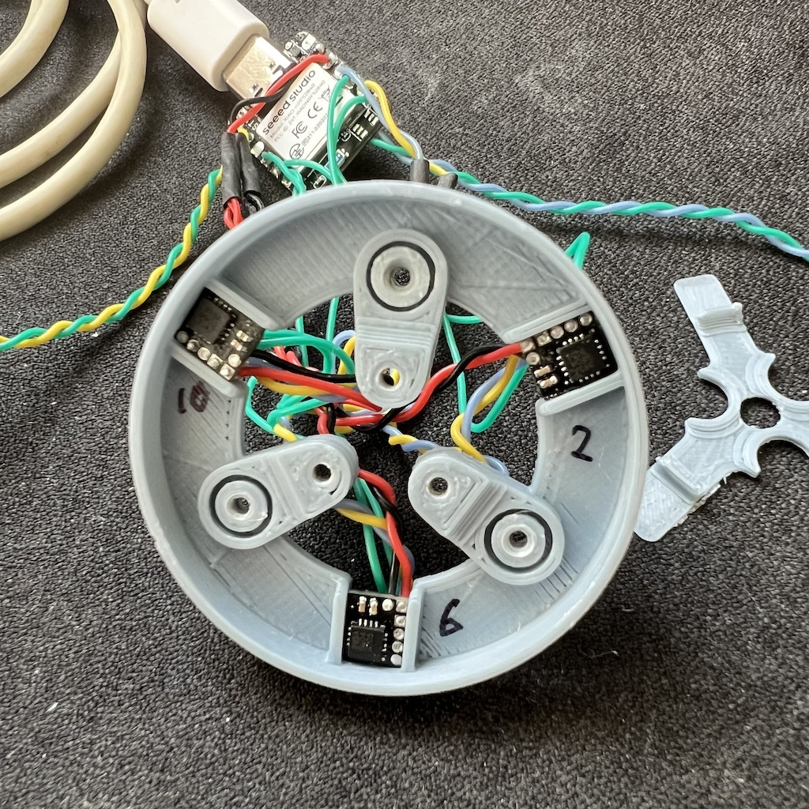

# Trackpuck

A 6 DoF peripheral fo CAD input.

### Design Principles
- 6DoF tracking output as HID Joystick
- Integrated magnetometers [mlx90393-pcb](https://github.com/badjeff/mlx90393-pcb)
- Powered by [ZMK](https://github.com/zmkfirmware/zmk) => OSS, on-devie profiling, say no to vendor lock eco-system
- Compatible for seeed xiao ble form factor mcu board
- 3D printed go-first
- Wireless
- Ligthweight
- Medium to small size
- Rigid
- Low Profile

### Gallery

https://github.com/user-attachments/assets/f231d02b-527b-4762-a200-921404486fa5

*Video 1: Navigating in Fusion 360 with TrackpuckTools Add-ins

### BOM
|Unit|Item|
|-|-|
|1|Seeed Studio XIAO BLE (nRF52840)|
|3|MLX90393SLW Sensor [Breakout](https://github.com/badjeff/mlx90393-pcb)|
|3|3mm x 1mm (Diameter x Height) Neodymium Magnets|
|4|ALPS SKRAAWE010 Micro Switch|
|1|MSK-1153 6 Pins Power Switch|
|1|3x4x2mm Tact Switch Turtle Switch|
|1|601230 Lipo Battery (plus connector)|
|6|6mm x 12mm x 4.7mm Springs|
|10|M2 Thread Head Inserts 3.1mm x 3mm (Diameter x Height) |
|6|10mm M2 Sunk Head Screws |
|6|4mm M2 Sunk Head Screws|
|4|3mm M2 Sunk Head Screws|
|1|28/26 AWG silicone wire|

### Building Guide / Tips

- NOT for beginner. Requiring experience of building at least one wireless keyboard on [ZMK](https://github.com/zmkfirmware/zmk).
- MUST have a funcation brain. Requiring to puzzling to assemble all parts together.
- NEED very good eyesight, and soldering skill (and tools).
- Build the core tower first.
- Sensor breakouts order is counter clockwise started from 6 o'clock position
- This peripheral doesn't required the weights. Use reusable self-adhesive sticky silicone gel pads from [Amazon](https://www.amazon.co.uk/silicone-Anti-Slip-holders-washable-transparent/dp/B07CGRHT31).
- Tell AI agent read [this file](https://github.com/badjeff/trackpuck-zmk-config/blob/main/boards/shields/trackpuck/input_processor_trixer.c) before you prompt it to adjust the rates for you. But, you still can find each config description in .yml file before messing up the default rates.

### Firmware

The ZMK firmware config repository can be find at [here](https://github.com/badjeff/trackpuck-zmk-config).

### Related Projects

- [TrackpuckTools](https://github.com/badjeff/TrackpuckTools-Fusion360) is a Fusion 360 add-in that connects HID-based 6DoF input peripheral devices as navigation input for Fusion 360, providing fluid control over camera orbit, pan, zoom, and rotation.

- [Magnetometers tracking simulator web app](https://sim7dof4ve.vercel.app/) will show how this all thigs works.

- [A example web app](https://trackpuck-threejs-examples.vercel.app/). Used to test HID Joystick outputs via web gamepad api.

## License

This work is licensed under a Creative Commons Attribution-NonCommercial-ShareAlike 4.0 International License. (CC BY-NC-SA 4.0)
